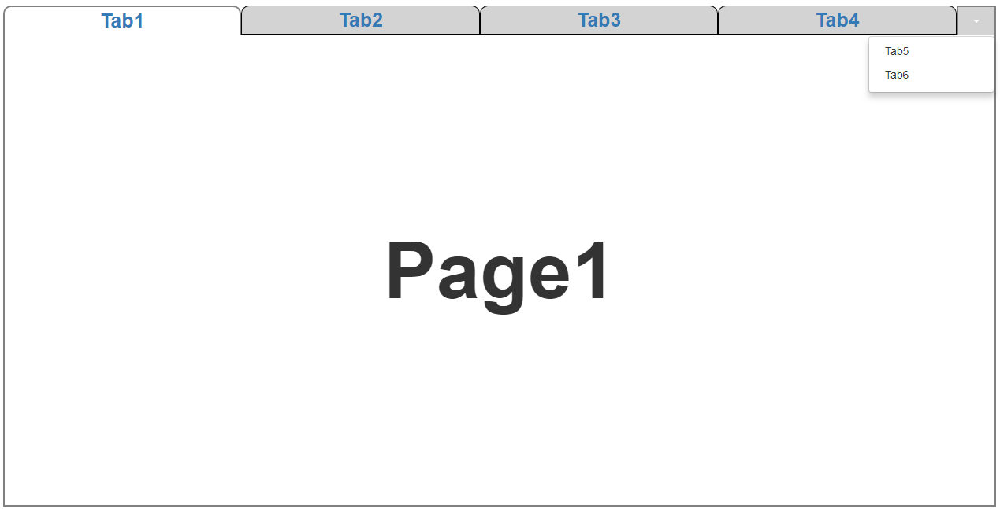
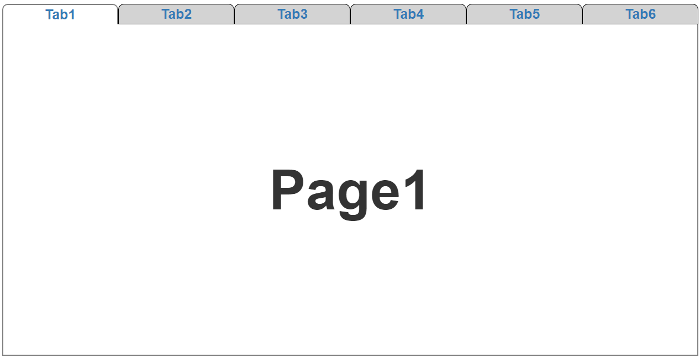

Dynamic Number Tab is a project developed in angular 2 and bootstrap with functionality of routing.
This project can be used as a initial project setup.


### Getting Started :
Download the "Dynamic Number Tab" folder, and install the required packages by following command.

Installing

```
npm install
```
Run server

```
ng serve
```

## How to use?
 Number of tab that you want to show, specify in app.component.html
 by providing value to filed [noOfHeadresToShow] in  app-header tag .

```
	<app-header [noOfHeadresToShow]=4></app-header>
```
Remaining tab you will get in dropdown list.


if number of tab you want to show is less than total number of tab

<p align="center"></p>

if number of tab you want to show is equal to total number of tab

<p align="center"></p>

## Features
<ol>
		<li> Routing.</li>
		<li> You can enter url on address bar to get that page.</li>
		 <li>Sequence of tab always will be in order as you provide their index in header.json (in assets folder ).</li>
  </ol>

